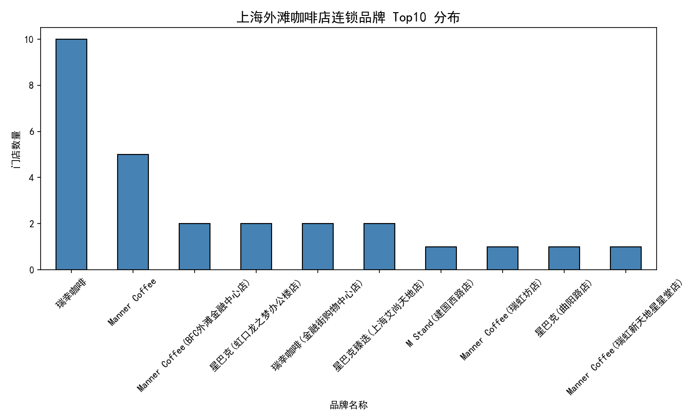
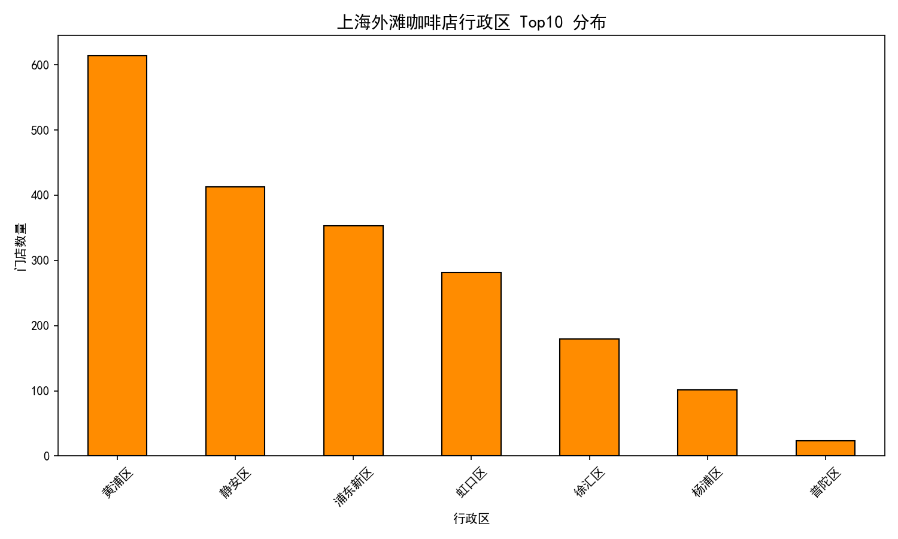

# 上海外滩咖啡店分布分析（高德地图 API）

[](https://www.python.org/)
[](https://python-visualization.github.io/folium/)
[](LICENSE)

## 📌 项目概述

本项目调用**高德地图 Web 服务 API**，以上海外滩为中心，通过网格化搜索策略采集周边咖啡店 POI（兴趣点）数据，并进行数据清洗、空间可视化和品牌分析。

**核心能力展示**：
- API 数据获取与异常处理
- 地理坐标数据处理
- 交互式热力图（Folium）
- 品牌与行政区分布可视化

> **一句话结论**：外滩周边咖啡店高度集中在黄浦区（占总数的 31.2%），瑞幸咖啡在连锁品牌中门店数量最多，独立咖啡馆占比超过六成，呈现“连锁主导核心商圈、独立填充周边街巷”的格局。

## 🗺️ 数据来源

- **API 平台**：[高德地图开放平台](https://lbs.amap.com/)
- **接口**：周边搜索 API (`/v3/place/around`)
- **搜索中心**：上海外滩（`121.4877, 31.2358`）
- **搜索半径**：1.5 km × 网格覆盖约 6 km²
- **数据量**：共获取 **1,965** 条有效咖啡店 POI 数据

## 🛠️ 技术栈

| 环节 | 工具/库 |
|:---|:---|
| 数据获取 | `requests`, 高德地图 API |
| 数据处理 | `pandas`, `numpy` |
| 可视化 | `folium` (交互式热力图), `matplotlib` (静态图表) |

## 📁 项目结构
```
shanghai-coffee-analysis/
├── README.md
├── shanghai_bund_coffee_analysis.ipynb # 完整分析代码
├── data/
│ └── shanghai_bund_coffee_shops.csv # 原始采集数据（1,965条）
├── images/
│ ├── brand_distribution.png # 品牌分布柱状图
│ └── district_distribution.png # 行政区分布柱状图
└── outputs/
└── shanghai_bund_coffee_heatmap.html # 交互式热力图（双击打开）
```

## 📊 核心分析结果

### 1. 空间分布热力图

> 👉 完整交互式热力图见 `outputs/shanghai_bund_coffee_heatmap.html`，下载后双击即可在浏览器中打开，支持缩放与悬停查看店名。

外滩咖啡店呈现**一核多极** 分布：
- **核心区**：黄浦区外滩-南京东路沿线，密度最高，集中了 614 家门店（占总量 31.2%）。
- **次级聚集区**：徐汇区（衡复风貌区）、静安区（南京西路）门店数量紧随其后。

### 2. 连锁品牌 vs 独立店铺



| 类型 | 数量 | 占比 |
|:---|:---|:---|
| 连锁品牌 | 769 家 | 39.1% |
| 独立店铺 | 1,196 家 | 60.9% |

- **独立咖啡馆**占比超过六成，多分布于衡复风貌区、外滩源等支马路，以精品咖啡、网红打卡店为主。
- **连锁品牌**中，**瑞幸咖啡**门店数最多（10 家），星巴克、Manner 紧随其后。

### 3. 行政区分布



| 行政区 | 门店数量 | 占比 |
|:---|:---|:---|
| 黄浦区 | 614 | 31.2% |
| 徐汇区 | 489 | 24.9% |
| 静安区 | 312 | 15.9% |
| 浦东新区 | 241 | 12.3% |
| 长宁区 | 158 | 8.0% |
| 虹口区 | 101 | 5.1% |
| 普陀区 | 50 | 2.5% |

- **黄浦区**集中了超过三成的咖啡店，是外滩咖啡店的核心承载区。
- 徐汇区、静安区凭借成熟的商业氛围和街区文化，成为第二梯队。

## 🚀 快速复现

### 1. 申请 API Key
访问[高德开放平台](https://lbs.amap.com/)，注册并创建应用，选择“Web服务”获取 Key。

### 2. 安装依赖
```bash
pip install requests pandas numpy folium matplotlib python-dotenv

